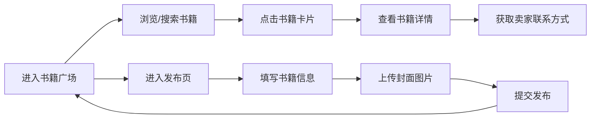

## 1. 产品概述

校园二手书交易平台，为高校学生提供便捷的二手书籍买卖服务，解决教材、参考书循环利用的需求。
- 目标用户：在校大学生、研究生
- 产品价值：降低购书成本，促进资源循环，打造校园内部可信赖的二手书交易社区

## 2. 核心功能

### 2.1 用户角色

| 角色 | 注册方式 | 核心权限 |
|------|---------|---------|
| 普通用户 | 无需注册（演示版） | 浏览书籍、查看详情、发布书籍 |

### 2.2 功能模块

1. **书籍广场页**：顶部搜索栏、瀑布流书籍卡片展示、新旧程度筛选
2. **书籍详情页**：书籍封面大图、书籍基本信息、卖家留言、联系方式展示
3. **发布页**：封面图片上传、书名/ISBN/价格/新旧程度/描述表单填写、提交发布

### 2.3 页面详情

| 页面名称 | 模块名称 | 功能描述 |
|---------|---------|---------|
| 书籍广场页 | 搜索栏 | 按书名模糊搜索，实时过滤结果 |
| 书籍广场页 | 瀑布流展示 | 多列瀑布流布局，响应式自适应列数 |
| 书籍广场页 | 书籍卡片 | 封面图、书名、价格、新旧标签、点击跳转详情 |
| 书籍详情页 | 书籍信息区 | 大图封面、书名、ISBN、价格、新旧程度 |
| 书籍详情页 | 卖家信息区 | 卖家留言描述、联系方式（QQ/微信/电话） |
| 发布页 | 表单组件 | 图片上传、输入框、下拉选择、文本域、提交按钮 |

## 3. 核心流程

用户进入书籍广场 → 浏览或搜索书籍 → 点击卡片进入详情 → 查看卖家联系方式完成线下交易
用户也可直接进入发布页 → 填写书籍信息 → 上传封面 → 提交发布 → 返回广场查看新发布书籍

## 4. 用户界面设计

### 4.1 设计风格

- **主色调**：深蓝色系，主色 `#1e3a8a`，辅助色 `#3b82f6`，深色背景 `#0f172a`
- **按钮风格**：Material Design 圆角按钮，带阴影和涟漪效果
- **卡片风格**：圆角 12px，多层阴影，悬停抬升效果
- **字体**：中文使用 "PingFang SC" / "Microsoft YaHei"，英文使用系统无衬线字体
- **布局**：顶部导航栏固定，内容区自适应，卡片式 Material Design 风格
- **图标**：使用 Lucide React 图标库，线性风格

### 4.2 页面设计概览

| 页面名称 | 模块名称 | UI 元素 |
|---------|---------|---------|
| 书籍广场页 | 搜索栏 | 固定顶部、深蓝背景、搜索图标、输入框圆角 |
| 书籍广场页 | 瀑布流卡片 | 封面图比例自适应、价格强调色、新旧标签胶囊样式、阴影层次 |
| 书籍详情页 | 信息展示 | 双栏布局（桌面）/ 单栏布局（移动端）、大号封面图、价格高亮 |
| 发布页 | 表单 | Material Design 风格输入框、标签悬浮效果、上传区域虚线边框 |

### 4.3 响应式设计

- 桌面端（≥1024px）：3-4 列瀑布流，详情页双栏布局
- 平板端（768-1023px）：2-3 列瀑布流
- 移动端（<768px）：1-2 列瀑布流，详情页单栏布局，触控优化
