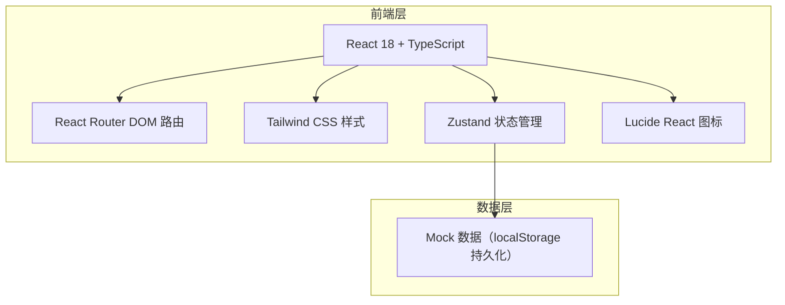
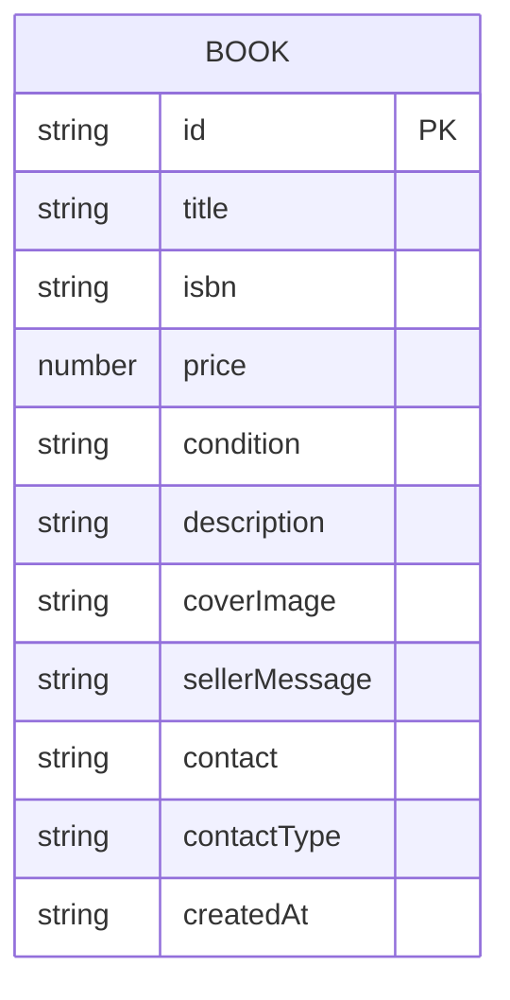

## 1. 架构设计



## 2. 技术描述

- **前端框架**：React@18 + TypeScript + Vite
- **初始化工具**：vite-init（react-ts 模板）
- **路由管理**：react-router-dom
- **状态管理**：zustand
- **样式方案**：Tailwind CSS 3
- **图标库**：lucide-react
- **数据持久化**：localStorage + Mock 数据
- **后端**：无（纯前端演示，数据存储在浏览器本地）

## 3. 路由定义

| 路由 | 用途 |
|-----|------|
| `/` | 书籍广场页（首页） |
| `/book/:id` | 书籍详情页 |
| `/publish` | 发布书籍页 |

## 4. 数据模型

### 4.1 数据模型定义



### 4.2 TypeScript 类型定义

```typescript
interface Book {
  id: string;
  title: string;
  isbn: string;
  price: number;
  condition: '全新' | '九成新' | '八成新' | '七成新' | '六成新及以下';
  description: string;
  coverImage: string;
  sellerMessage: string;
  contact: string;
  contactType: 'QQ' | '微信' | '电话';
  createdAt: string;
}

interface BookStore {
  books: Book[];
  searchKeyword: string;
  addBook: (book: Omit<Book, 'id' | 'createdAt'>) => void;
  getBookById: (id: string) => Book | undefined;
  setSearchKeyword: (keyword: string) => void;
  filteredBooks: Book[];
}
```
