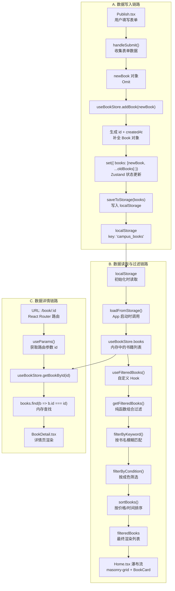
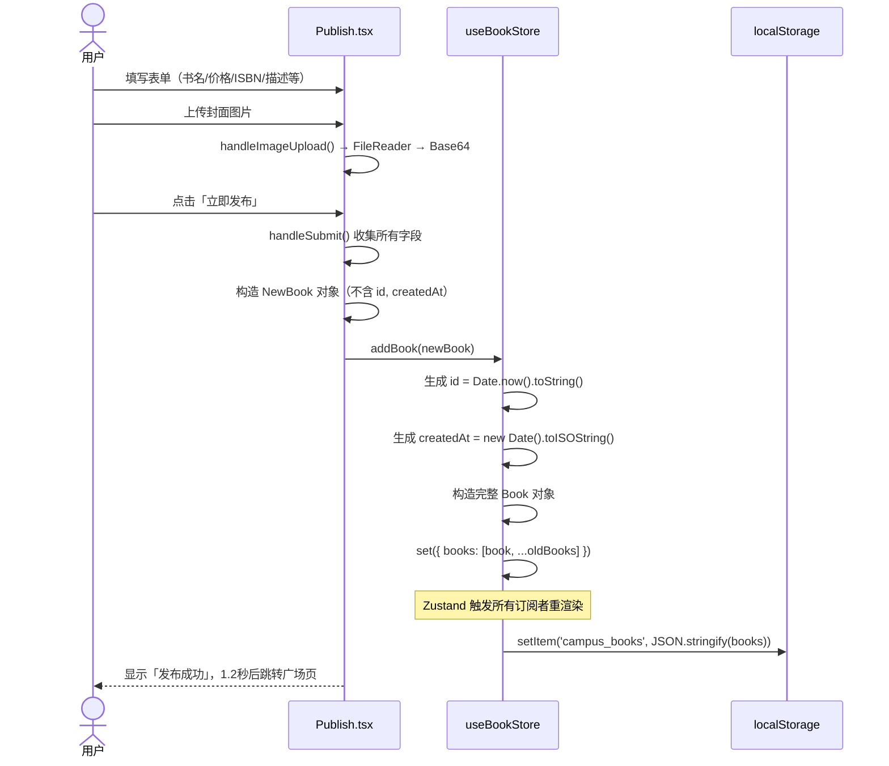
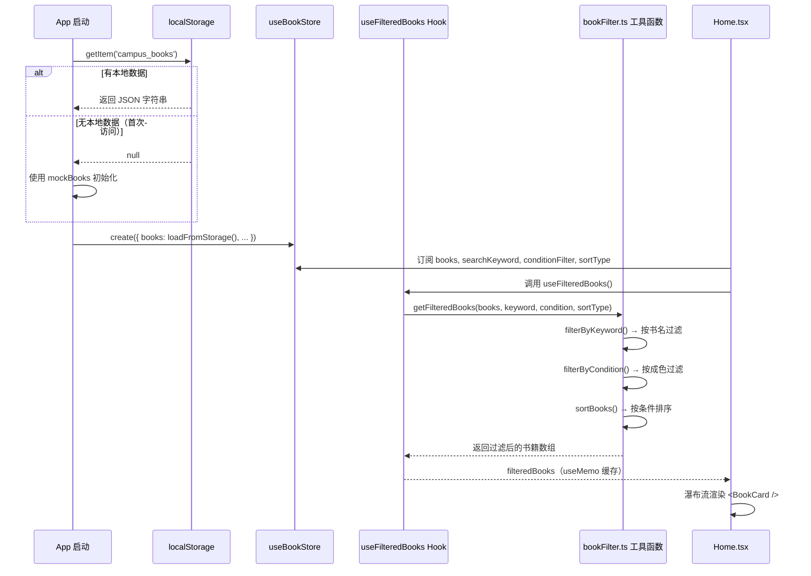
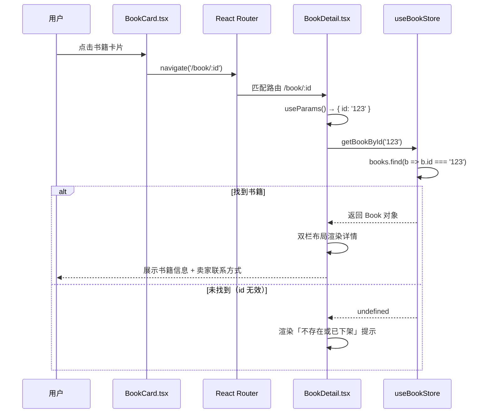

# 校园二手书交易平台 - 数据流转说明文档

## 概述

本文档详细描述校园二手书交易平台的数据流转全链路，涵盖**数据写入**（发布页 → Store → localStorage）、**数据读取与过滤**（广场页读取 → 搜索过滤 → 瀑布流渲染）、**数据详情展示**（详情页按 ID 取数）三大核心流程。

---

## 整体数据流架构



---

## A. 数据写入链路：发布页 → Store → localStorage

### 链路图



### 关键节点详解

#### 1. [Publish.tsx](file:///d:/code/ai-prompt/solo-chrome-dev-F12/repos/repo21/project21/src/pages/Publish.tsx) - 表单收集与提交

**表单字段**：
| 字段 | 类型 | 必填 | 处理方式 |
|-----|------|-----|---------|
| coverImage | string | ✅ | `FileReader.readAsDataURL()` 转 Base64 |
| title | string | ✅ | 直接取值 |
| isbn | string | ❌ | 直接取值（可为空） |
| price | number | ✅ | `Number(price)` 转换 |
| condition | BookCondition | ✅ | 下拉选择，默认「八成新」 |
| description | string | ❌ | 空值默认「卖家暂未填写书籍描述」 |
| sellerMessage | string | ❌ | 空值默认「欢迎咨询~」 |
| contact | string | ❌ | 联系方式号码 |
| contactType | ContactType | ✅ | QQ / 微信 / 电话 |

**核心函数 `handleSubmit`** [Publish.tsx#L79-L108](file:///d:/code/ai-prompt/solo-chrome-dev-F12/repos/repo21/project21/src/pages/Publish.tsx#L79-L108)：
```typescript
const handleSubmit = async (e: FormEvent) => {
  e.preventDefault();
  setIsSubmitting(true);
  
  const newBook: NewBook = { title, isbn, price: Number(price), ... };
  await new Promise(r => setTimeout(r, 600)); // 模拟请求延迟
  addBook(newBook);
  
  setShowSuccess(true);
  setTimeout(() => navigate('/'), 1200);
};
```

#### 2. [useBookStore.ts](file:///d:/code/ai-prompt/solo-chrome-dev-F12/repos/repo21/project21/src/store/useBookStore.ts) - 状态管理与持久化

**`addBook` 方法** [useBookStore.ts#L43-L52](file:///d:/code/ai-prompt/solo-chrome-dev-F12/repos/repo21/project21/src/store/useBookStore.ts#L43-L52)：
```typescript
addBook: (newBook) => {
  const book: Book = {
    ...newBook,
    id: Date.now().toString(),           // 时间戳作为唯一 ID
    createdAt: new Date().toISOString(),  // ISO 格式时间
  };
  const books = [book, ...get().books];   // 新发布的书排最前
  set({ books });                         // Zustand 更新状态
  saveToStorage(books);                   // 持久化到 localStorage
}
```

**`saveToStorage` 函数** [useBookStore.ts#L29-L35](file:///d:/code/ai-prompt/solo-chrome-dev-F12/repos/repo21/project21/src/store/useBookStore.ts#L29-L35)：
```typescript
const saveToStorage = (books: Book[]) => {
  try {
    localStorage.setItem(STORAGE_KEY, JSON.stringify(books));
  } catch {
    console.error('Failed to save books to storage');
  }
};
```

#### 3. localStorage - 持久化存储

- **Key**: `'campus_books'`
- **Value**: `JSON.stringify(Book[])` 
- **触发时机**：每次 `addBook` 后同步写入
- **容量限制**：单条最大约 5MB（浏览器 localStorage 限制）
- **注意**：封面图 Base64 会占用较大空间，大量发布可能触达上限

---

## B. 数据读取与过滤链路：广场页 → 搜索过滤 → 瀑布流渲染

### 链路图



### 关键节点详解

#### 1. App 启动初始化

**`loadFromStorage` 函数** [useBookStore.ts#L19-L27](file:///d:/code/ai-prompt/solo-chrome-dev-F12/repos/repo21/project21/src/store/useBookStore.ts#L19-L27)：
```typescript
const loadFromStorage = (): Book[] => {
  try {
    const stored = localStorage.getItem(STORAGE_KEY);
    if (stored) return JSON.parse(stored);
  } catch {
    console.error('Failed to load books from storage');
  }
  return mockBooks;  // 降级到预置 Mock 数据
};
```

**初始化时机**：`create<BookStore>((set, get) => ({ books: loadFromStorage(), ... }))`

#### 2. [useFilteredBooks.ts](file:///d:/code/ai-prompt/solo-chrome-dev-F12/repos/repo21/project21/src/hooks/useFilteredBooks.ts) - 响应式派生状态

**核心机制**：使用独立 selector 订阅每个状态 + `useMemo` 显式依赖 = 100% 响应式可靠

```typescript
export function useFilteredBooks() {
  // 每个状态单独订阅，Zustand 精确追踪变化
  const books = useBookStore((state) => state.books);
  const searchKeyword = useBookStore((state) => state.searchKeyword);
  const conditionFilter = useBookStore((state) => state.conditionFilter);
  const sortType = useBookStore((state) => state.sortType);

  // React useMemo 保证依赖变化才重计算
  return useMemo(
    () => getFilteredBooks(books, searchKeyword, conditionFilter, sortType),
    [books, searchKeyword, conditionFilter, sortType],
  );
}
```

> **架构决策记录**：曾尝试在 Store 内用 getter 实现，但 Zustand 不会追踪 getter 内部依赖，导致筛选/排序切换时偶发不刷新。改为 Hook + useMemo 后问题解决。

#### 3. [bookFilter.ts](file:///d:/code/ai-prompt/solo-chrome-dev-F12/repos/repo21/project21/src/utils/bookFilter.ts) - 纯函数过滤管道

**三级过滤管道**：

```
原始 books → filterByKeyword → filterByCondition → sortBooks → 结果
```

**`filterByKeyword`** [bookFilter.ts#L3-L7](file:///d:/code/ai-prompt/solo-chrome-dev-F12/repos/repo21/project21/src/utils/bookFilter.ts#L3-L7)：
```typescript
export function filterByKeyword(books: Book[], keyword: string): Book[] {
  const trimmed = keyword.trim().toLowerCase();
  if (!trimmed) return books;
  return books.filter((b) => b.title.toLowerCase().includes(trimmed));
}
```

**`filterByCondition`** [bookFilter.ts#L9-L12](file:///d:/code/ai-prompt/solo-chrome-dev-F12/repos/repo21/project21/src/utils/bookFilter.ts#L9-L12)：
```typescript
export function filterByCondition(books: Book[], condition: ConditionFilter): Book[] {
  if (condition === 'all') return books;
  return books.filter((b) => b.condition === condition);
}
```

**`sortBooks`** [bookFilter.ts#L14-L22](file:///d:/code/ai-prompt/solo-chrome-dev-F12/repos/repo21/project21/src/utils/bookFilter.ts#L14-L22)：
```typescript
export function sortBooks(books: Book[], sortType: SortType): Book[] {
  const sorted = [...books];  // 不修改原数组
  if (sortType === 'latest') {
    sorted.sort((a, b) => 
      new Date(b.createdAt).getTime() - new Date(a.createdAt).getTime()
    );
  } else if (sortType === 'price-asc') {
    sorted.sort((a, b) => a.price - b.price);
  }
  return sorted;
}
```

**组合入口 `getFilteredBooks`** [bookFilter.ts#L24-L33](file:///d:/code/ai-prompt/solo-chrome-dev-F12/repos/repo21/project21/src/utils/bookFilter.ts#L24-L33)：
```typescript
export function getFilteredBooks(
  books: Book[], keyword: string, condition: ConditionFilter, sortType: SortType
): Book[] {
  const afterKeyword = filterByKeyword(books, keyword);
  const afterCondition = filterByCondition(afterKeyword, condition);
  return sortBooks(afterCondition, sortType);
}
```

#### 4. [Home.tsx](file:///d:/code/ai-prompt/solo-chrome-dev-F12/repos/repo21/project21/src/pages/Home.tsx) - 瀑布流渲染

**CSS 多列瀑布流实现** [index.css#L57-L73](file:///d:/code/ai-prompt/solo-chrome-dev-F12/repos/repo21/project21/src/index.css#L57-L73)：
```css
.masonry-grid { column-count: 1; column-gap: 1rem; }
@media (min-width: 640px) { .masonry-grid { column-count: 2; } }
@media (min-width: 1024px) { .masonry-grid { column-count: 3; } }
@media (min-width: 1280px) { .masonry-grid { column-count: 4; } }
.masonry-item { break-inside: avoid; margin-bottom: 1rem; }
```

**渲染循环** [Home.tsx#L127-L135](file:///d:/code/ai-prompt/solo-chrome-dev-F12/repos/repo21/project21/src/pages/Home.tsx#L127-L135)：
```tsx
{filteredBooks.length > 0 ? (
  <div className="masonry-grid">
    {filteredBooks.map((book) => (
      <div key={book.id} className="masonry-item">
        <BookCard book={book} />
      </div>
    ))}
  </div>
) : (
  <EmptyState />
)}
```

---

## C. 数据详情链路：路由参数 → ID 查找 → 详情展示

### 链路图



### 关键节点详解

#### 1. 路由跳转

**[BookCard.tsx](file:///d:/code/ai-prompt/solo-chrome-dev-F12/repos/repo21/project21/src/components/BookCard.tsx#L13-L15) 卡片链接**：
```tsx
<Link to={`/book/${book.id}`} className="block group">
  {/* 卡片内容 */}
</Link>
```

**[App.tsx](file:///d:/code/ai-prompt/solo-chrome-dev-F12/repos/repo21/project21/src/App.tsx#L24) 路由定义**：
```tsx
<Route path="/book/:id" element={<BookDetail />} />
```

#### 2. [BookDetail.tsx](file:///d:/code/ai-prompt/solo-chrome-dev-F12/repos/repo21/project21/src/pages/BookDetail.tsx) - 按 ID 取数

**`getBookById` 方法** [useBookStore.ts#L54](file:///d:/code/ai-prompt/solo-chrome-dev-F12/repos/repo21/project21/src/store/useBookStore.ts#L54)：
```typescript
getBookById: (id) => get().books.find((b) => b.id === id)
```

**页面调用** [BookDetail.tsx#L13-L16](file:///d:/code/ai-prompt/solo-chrome-dev-F12/repos/repo21/project21/src/pages/BookDetail.tsx#L13-L16)：
```typescript
const { id } = useParams<{ id: string }>();
const book = useBookStore((state) => state.getBookById(id || ''));
```

> **注意**：`getBookById` 通过 selector 传入 Store，当 `books` 数组变化时会重新执行查找，保证数据一致性。

#### 3. 详情页布局

| 区域 | 内容 | 响应式布局 |
|-----|------|-----------|
| 左侧栏 | 封面大图、价格、新旧标签 | lg 以上 2/5 宽度，sticky 定位 |
| 右侧栏 | 书名、ISBN、书籍描述、卖家留言、联系方式 | lg 以上 3/5 宽度 |
| 移动端 | 单栏垂直排列 | 100% 宽度 |

---

## 全链路组件/函数调用关系表

### 写入链路调用栈

```
用户点击发布按钮
  ↓
Publish.tsx handleSubmit(e: FormEvent)
  ├─ 验证必填字段
  ├─ 构造 NewBook 对象
  ├─ setIsSubmitting(true)
  ├─ 模拟 600ms 延迟
  ├─ useBookStore.addBook(newBook)
  │   ├─ 生成 id: Date.now().toString()
  │   ├─ 生成 createdAt: ISO 字符串
  │   ├─ set({ books: [newBook, ...oldBooks] })
  │   │   └─ Zustand 通知所有订阅组件重渲染
  │   └─ saveToStorage(books)
  │       └─ localStorage.setItem('campus_books', ...)
  ├─ setShowSuccess(true)
  └─ setTimeout(() => navigate('/'), 1200)
```

### 读取链路调用栈

```
Home.tsx 首次渲染
  ├─ useFilteredBooks()
  │   ├─ useBookStore(s => s.books)           ← 订阅
  │   ├─ useBookStore(s => s.searchKeyword)   ← 订阅
  │   ├─ useBookStore(s => s.conditionFilter) ← 订阅
  │   ├─ useBookStore(s => s.sortType)        ← 订阅
  │   └─ useMemo(
  │        () => getFilteredBooks(...),
  │        [books, searchKeyword, conditionFilter, sortType]
  │      )
  │          ├─ filterByKeyword(books, keyword)
  │          ├─ filterByCondition(result, condition)
  │          └─ sortBooks(result, sortType)
  └─ 瀑布流映射 filteredBooks.map(book => <BookCard />)
```

### 详情链路调用栈

```
用户点击 BookCard
  ↓
React Router navigate('/book/:id')
  ↓
BookDetail.tsx 渲染
  ├─ useParams() → { id: string }
  ├─ useBookStore(s => s.getBookById(id))
  │   └─ books.find(b => b.id === id)
  ├─ 未找到 → 渲染空状态 + 返回链接
  └─ 已找到 → 渲染详情布局
        ├─ 封面图 + 价格 + 新旧标签
        ├─ 书名 + ISBN + 描述
        ├─ 卖家留言卡片
        └─ 联系方式高亮区
```

---

## 状态变更触发源汇总

| 状态 | 触发源 | 影响范围 |
|-----|-------|---------|
| `books` | `addBook()` 发布新书 | 所有页面 + localStorage |
| `searchKeyword` | Navbar 搜索框 `onChange` | useFilteredBooks 重计算 |
| `conditionFilter` | Home 页成色标签点击 | useFilteredBooks 重计算 |
| `sortType` | Home 页排序按钮点击 | useFilteredBooks 重计算 |

---

## 关键设计决策

| 决策点 | 方案 | 理由 |
|-------|-----|-----|
| 状态管理 | Zustand + 自定义 Hook | 轻量、TS 友好、无需 Provider |
| 派生状态计算 | useMemo + 独立 selector | 解决 Zustand getter 响应式不可靠问题 |
| 过滤逻辑 | 纯函数管道 | 易测试、易扩展、可复用 |
| 持久化方案 | localStorage 同步写入 | 无需后端，刷新不丢数据 |
| ID 生成 | `Date.now().toString()` | 简单、单机唯一、时间有序 |
| 瀑布流实现 | CSS `column-count` | 无需 JS 计算，性能好 |
